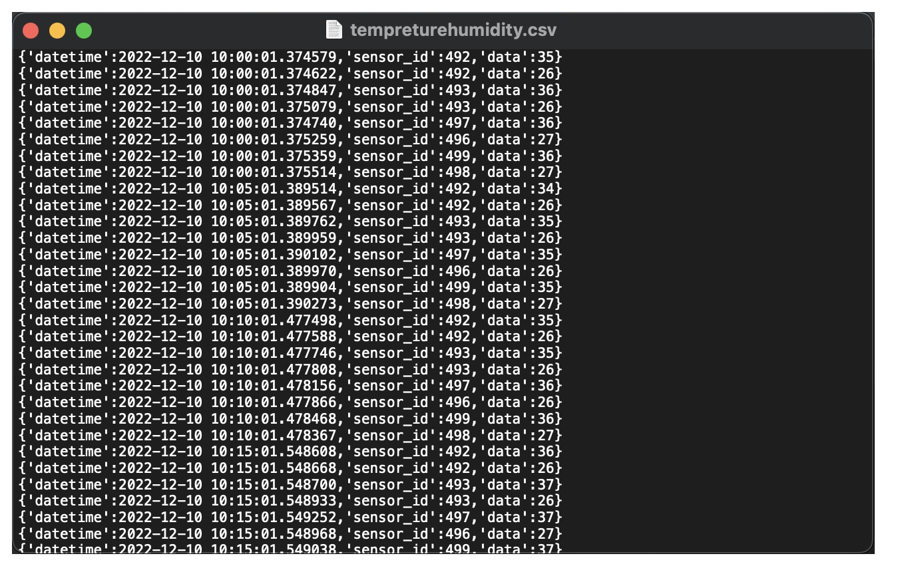

# Unit 2: A Distributed Weather Station for ISAK


**Fig.1**

# Criteria A: Planning

## Problem Definition
The client Mr. Figueroa is a student at UWC ISAK and he is a professional violinist. Therefore he is very concerned about the effect of the humidity and temperature in ISAK on his precious violin. He is looking for a way to find the humidity in his room with the most accurate yet affordable setup so that he can sleep well without worrying about the violin cracked when he wake up. He does not aim to look for a cheap alternative, he wants a proper sensor that could tell him the accurate temperature and humidity. He is also is willing to use python for easier control and he also hopes that Raspberry Pi could help him with the whole project since Raspberry Pies are very good.

## Proposed Solution
Considering the client requirements an adequate solution includes a low cost sensing device for humidity and temperature and a custom data script that process and anaysis the samples acquired. For a low cost sensing device an adequate alternative is the DHT11 sensor[^1] which is offered online for less than 5 USD and provides adequare precision and range for the client requirements (Temperature Range: 0°C to 50°C, Humidity Range: 20% to 90%). Similar devices such as the DHT22, AHT20 or the AM2301B [^2] have higher specifications, however the DHT11 uses a simple serial communication (SPI) rather than more eleborated protocols such as the I2C used by the alternatives. For the range, precision and accuracy required in this applicaiton the DHT11 provides the best compromise. Connecting the DHT11 sensor to a computer requires a device that provides a Serial Port communication. A cheap and often used alternative for prototyping is the Arduino UNO microcontroller [^3]. "Arduino is an open-source electronics platform based on easy-to-use hardware and software"[^4]. In additon to the low cost of the Arduino (< 6USD), this devide is programable and expandable[^1]. Other alternatives include diffeerent versions of the original Arduino but their size and price make them a less adequate solution.

Considering the budgetary constrains of the client and the hardware requirements, the software tool that I proposed for this solution is Python. Python is open source, it is mature and supported in mutiple platforms (platform-independent) including macOS, Windows, Linux and can also be used to program the Arduino microprocessor [^5][^6]. In comparison to the alternative C or C++, which share similar features, Python is a High level programming language (HLL) with high abstraction [^7]. For example, memory management is automatic in Python whereas it is responsability of the C/C++ developer to allocate and free up memory [^7], this could result in faster applications but also memory problems. In addition a HLL language will allow me and future developers extend the solution or solve issues proptly.  

## Design statement
We will make a poster with all of our progress documented. We will have a system diagram, the materials we used, the set up. And the process of actually programming and running it.  graphs that show the temperature and humidity in mean, standad deviation, minimum, maximum, and median so that the client will understand what the humidity and the temperature in his room is in one glance. We will also add a graph that shows a prediction of the subsequent 12 hours for both temperature and humidity. As a conclusion we will talk about the health effects that this data represents and the effect to the violin as well.

## Success Criteria

1. The solution provides a visual representation of the Humidity and Temperature values inside a dormitory (Local) and outside the house (Remote) for a period of minimum 48 hours. 
1. ```[HL]``` The local variables will be measure using a set of 4 sensors around the dormitory.
2. The solution provides a mathematical modelling for the Humidity and Temperature levels for each Local and Remote locations. ```(SL: linear model)```, ```(HL: non-lineal model)```
3. The solution provides a comparative analysis for the Humidity and Temperature levels for each Local and Remote locations including mean, standad deviation, minimum, maximum, and median.
4. ```(SL)```The Local samples are stored in a csv file and ```(HL)``` posted to the remote server.
5. Create a prediction the subsequent 12 hours for both temperature and humidity.
6. A poster summarizing the visual representations, model and analysis is created. The poster includes a recommendation about healthy levels for Temperature and Humidity.

# Criteria B: Design

## System Diagram **HL**


**Fig.2** shows the system diagram for the proposed solution (**HL**). The indoor variables will be measured using a Raspberry PI and four DHT11 sensors located inside a room. Four sensors are used to determine more precisely the physical values and include measurement uncertainty. The outdoor variables will be requested to the remote server using a GET request to the API of the server at ```192.168.6.147/readings```. The local values are stored in a CSV database locally and POST to the server using the API and TOKEN authentication. A laptop computer is used for remotely controlling the local Rasberry Pi using a Dekptop sharing application (VNC Viewer). (Optional) Data from the local raspberry is downloaded to the laptop for analysis and processing.

## Data Transmission

We have collected the data of the humidity and temprature from the sensors and write it into the csv file that we have created. And from that file we made a program that reads each line from the csv file and sends those data to the server in the json format using while loop.



**Fig.3** Above is the csv file that we used to store the data.

## Record of Tasks
| Task No |  Planned Action                                                | Planned Outcome                                                                                                 | Time estimate | Target completion date | Criterion |
|---------|---------------------------------------------------------------|-----------------------------------------------------------------------------------------------------------------|---------------|------------------------|-----------|
| 1       | Write the Problem context          | We identified what kind of problem the client could have and how that is affecting his daily routine             | 10min | Nov 22 | A
| 2       | Write the Problem Defenition  | We wrote the problem defenition to have a clear understanding of what the client needs | 20min | Nov 22 | A
| 3       | Create a bill of materials  | We identified all the materials we need for the project and made a list | 20 min | Nov 22 | A
| 4       | Understand how Raspberry Pi work  | We reaserched about raspberry pi to have a deeper understanding of how the servers and SSH works | 40 min | Nov 24 | A
| 5       | Reaserch how DHT11 sensor work  | We got a basic understanding of how the bread board and DHT11 sensor works, we also learnt how to connect them together | 30 min | Nov 24 | A
| 6       | Signing Scope of Work  | We got all the materials from Dr. Ruben that we listed up, and signed the Scope of work document | 5 min | Nov 25 | A
| 7       | 

## Test Plan

# Criteria C: Development

## List of techniques used

## Development


# Criteria D: Functionality

A 7 min video demonstrating the proposed solution with narration

[^1]: Industries, Adafruit. “DHT11 Basic Temperature-Humidity Sensor + Extras.” Adafruit Industries Blog RSS, https://www.adafruit.com/product/386. 
[^2]: Nelson, Carter. “Modern Replacements for DHT11 and dht22 Sensors.” Adafruit Learning System, https://learn.adafruit.com/modern-replacements-for-dht11-dht22-sensors/what-are-better-alternatives.   
[^3]:“How to Connect dht11 Sensor with Arduino Uno.” Arduino Project Hub, https://create.arduino.cc/projecthub/pibots555/how-to-connect-dht11-sensor-with-arduino-uno-f4d239.  
[^4]:Team, The Arduino. “What Is Arduino?: Arduino Documentation.” Arduino Documentation | Arduino Documentation, https://docs.arduino.cc/learn/starting-guide/whats-arduino.  
[^5]:Tino. “Tino/PyFirmata: Python Interface for the Firmata (Http://Firmata.org/) Protocol. It Is Compliant with Firmata 2.1. Any Help with Updating to 2.2 Is Welcome. the Capability Query Is Implemented, but the Pin State Query Feature Not Yet.” GitHub, https://github.com/tino/pyFirmata. 
[^6]:Python Geeks. “Advantages of Python: Disadvantages of Python.” Python Geeks, 26 June 2021, https://pythongeeks.org/advantages-disadvantages-of-python/. 
[^7]: Real Python. “Python vs C++: Selecting the Right Tool for the Job.” Real Python, Real Python, 19 June 2021, https://realpython.com/python-vs-cpp/#memory-management. 
